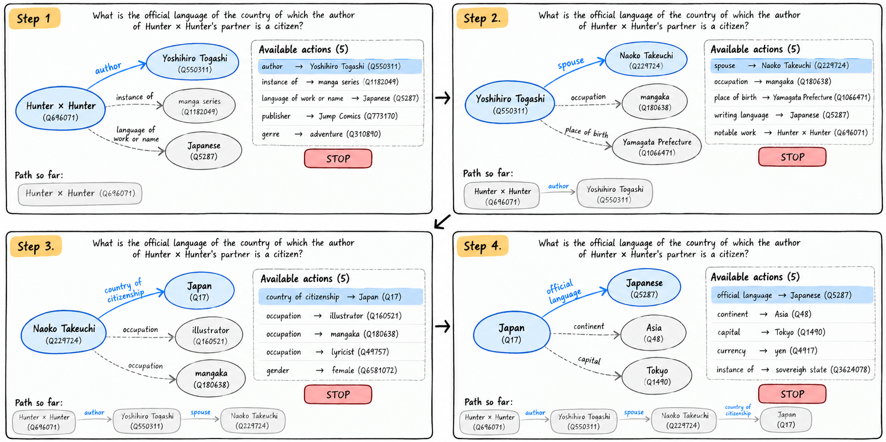

# LLMs KGQA Project

## Overview

This repository is the **official implementation** for the paper **“The Path Matters: Evaluating Small Language Models Beyond Answer Accuracy in KGQA”** by Eduin E. Hernandez, Sergio A. Diaz, Luis F. Garcia, Nurassyl Askar, and Stefano Rini. The preprint is available on [arXiv:2609.27669](https://arxiv.org/abs/2609.27669).

The paper evaluates frozen, locally deployable small language models (SLMs) as **question-conditioned graph-navigation policies**, measuring terminal-answer accuracy together with executed-path fidelity. It also includes a Think-on-Graph (ToG)-style comparison to study the effect of explicit search and answer-generation scaffolding.



*In the primary experimental setting, an SLM navigates the knowledge graph iteratively by selecting among the executable graph actions available at each step and deciding when to stop.*

The repository supports three KGQA workflows:

- **Iterative navigation QA**: the LLM selects legal graph actions step by step. This is the paper's primary experimental setting.
- **Think-on-Graph (ToG)**: a local adaptation of the original ToG search procedure used for the paper's secondary search comparison.
- **Subgraph QA**: the LLM receives a sampled subgraph and predicts the final answer directly.

The main entry points are `kgqa_navigation.py`, `kgqa_tog.py`, and `kgqa_subgraph.py`.

## Installation

Python 3.12 or newer is required.

```bash
pip install -r requirements.txt
```

### Backend Setup

The experiments support either **Ollama directly** or **Open WebUI backed by Ollama**.

Copy the provided backend configuration template before running the experiments:

```bash
cp configs/openwebui_template.json configs/openwebui_config.json
```

Then configure the selected backend and make sure the model referenced by your model profile is available.

See [docs/backend.md](docs/backend.md) for Ollama installation/model downloads, Open WebUI model availability, connection settings, and API-key setup.

### Model Profiles

Models are configured through validated JSON profiles under `configs/models/` rather than repository-specific model-name conventions.

A profile records the backend model ID, model family, instruct/quantization metadata, context-window limit, and declared capabilities. Select one with:

```bash
--model-config configs/models/qwen3.json
```

If another server exposes the same deployed model under a different ID, override only the API-facing identifier:

```bash
--model-config configs/models/qwen3.json \
--model-id my-server-model-alias
```

See [configs/models/README.md](configs/models/README.md) for the profile schema and validation rules.

## Datasets

The paper evaluates the navigation-ready **KINSHIP** and **MQuAKE-ST** resources, including the Single Answer and Multi Answer MQuAKE-ST settings.

Dataset releases, preparation details, and associated THESEUS resources are maintained in the [THESEUS repository](https://github.com/HalcyonSolutions/THESEUS). The processed datasets are also available from Hugging Face:

- [HalcyonSolutions/Kinship](https://huggingface.co/datasets/HalcyonSolutions/Kinship)
- [HalcyonSolutions/MQuAKE-ST](https://huggingface.co/datasets/HalcyonSolutions/MQuAKE-ST)

### Dataset Preparation

The preprocessing scripts expect the downloaded releases under `raw_data/` and copy the files required by the experiment runners into `data/`. The scripts do not download the datasets themselves.

Using the Hugging Face CLI, the expected raw layouts can be created with:

```bash
hf download HalcyonSolutions/Kinship \
  --repo-type dataset \
  --local-dir ./raw_data/kinship_hinton

hf download HalcyonSolutions/MQuAKE-ST \
  --repo-type dataset \
  --local-dir ./raw_data/mquake_st_dataset
```

Equivalent dataset downloads from Google Cloud Storage can be placed in the same `raw_data/` directories.

Then preprocess both datasets from the repository root:

```bash
bash scripts/preprocess_kinship.sh
bash scripts/preprocess_mquake_st.sh
```

This creates the runner-ready datasets under:

```text
data/kinship/
data/mquake_single/
data/mquake_multi/
```

Both `raw_data/` and `data/` are local working directories and are excluded from version control.

See [docs/datasets.md](docs/datasets.md) for the expected processed file layout and optional entity/relation mappings.

## Reproducing the Paper Experiments

Run the experiment scripts from the repository root.

### Tables 2 and 3: Navigation

The one-shot navigation results and the zero-shot versus one-shot comparison are reproduced with:

```bash
bash scripts/kgqa_navigation_runs.sh
```

### Table 4: Think-on-Graph

The ToG-style search comparison is reproduced with:

```bash
bash scripts/kgqa_tog_runs.sh
```

These scripts contain the model, dataset, prompting, navigation/search, and inference settings used for the reported experiments.

See [docs/reproducibility.md](docs/reproducibility.md) for the exact configurations encoded by the scripts.

## Quick Usage

### Iterative Navigation QA

```bash
python ./kgqa_navigation.py \
  --dataset mquake_single \
  --hops n \
  --model-config configs/models/qwen3.json \
  --navigation-approach tuple \
  --memory-approach full \
  --prompting-approach zero-shot \
  --n-shots 0 \
  --max-navigation-steps 4 \
  --max-actions 200 \
  --result-dir ./results
```

Navigation supports tuple, factorized, and hybrid action selection together with zero-shot and n-shot prompting.

See [docs/navigation.md](docs/navigation.md) for prompting, memory, action-selection, truncation, context-window, and debugging options.

### Think-on-Graph

```bash
python ./kgqa_tog.py \
  --dataset mquake_single \
  --model-config configs/models/qwen3.json
```

The local adapter preserves the upstream ToG prompt family while adapting graph access, entity/relation mappings, evaluation, and result logging to this repository.

See [docs/tog.md](docs/tog.md) for the upstream revision, search procedure, fallback behavior, parsing policy, answer evaluation, implementation differences, audit trail, and result versioning.

### Subgraph QA

```bash
python ./kgqa_subgraph.py \
  --dataset mquake_single \
  --hops n \
  --model-config configs/models/qwen3.json \
  --sampling-method neighborhood \
  --subgraph-size 50 \
  --max-depth 3 \
  --result-dir ./results
```

See [docs/subgraph.md](docs/subgraph.md) for sampling and retrieval options.

## Repository Structure

```text
analysis/   result compilation, diagnostics, comparisons, and plotting
configs/    API/backend configuration templates
docs/       detailed workflow and reproducibility documentation
model/      shared and task-specific LLM clients
scripts/    experiment, sample, sanity-check, and reproducibility scripts
tests/      unit, integration, and behavior tests
tools/      standalone debugging and development utilities
utils/      graph, metrics, KGQA, parsing, and API utilities
```

The local `data/` directory and generated `results/` directory are not checked into the repository.

For a module-level overview, see [docs/development.md](docs/development.md).

## Results and Analysis

Generated outputs are written under `results/`.

Navigation results include the run configuration, aggregate statistics, per-question episodes, executed paths, path-fidelity and final-entity metrics, and prompt/action truncation metadata. ToG results additionally retain search, answer-source, parsing, and formatting audit information.

Common analysis commands include:

```bash
python analysis/compile_navigation_results.py --dataset kinship
python analysis/plot_metric.py --dataset mquake
```

See [docs/results.md](docs/results.md) for result fields, ToG audit metadata, and the available analysis utilities.

## Documentation

Detailed documentation is available under [docs/](docs/README.md):

- [Navigation](docs/navigation.md)
- [Think-on-Graph](docs/tog.md)
- [Subgraph QA](docs/subgraph.md)
- [Datasets](docs/datasets.md)
- [Reproducibility](docs/reproducibility.md)
- [Results and Analysis](docs/results.md)
- [Development](docs/development.md)

## Citation

If you use this repository, please cite:

```bibtex
@article{hernandez2026path,
  title         = {The Path Matters: Evaluating Small Language Models Beyond Answer Accuracy in KGQA},
  author        = {Eduin E. Hernandez and Sergio A. Diaz and Luis F. Garcia and Nurassyl Askar and Stefano Rini},
  year          = {2026},
  journal       = {arXiv preprint arXiv:2609.27669}
}
```

## License

This project is licensed under the [Apache License 2.0](LICENSE).

Third-party datasets, model weights, and other external resources remain
subject to their respective licenses and terms of use.